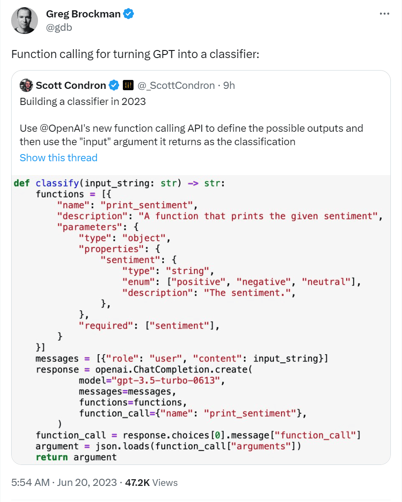

# function_calling_sentiment

Showcasing the application of OpenAI's function calling feature in sentiment analysis.

## Origin

On June 20, 2023, Greg Brockman, OpenAI's President and Co-founder, tweeted about converting GPT into a classifier using the function calling feature. He retweeted Scott Condron's post, which explained how to use OpenAI's new API to specify potential outputs and use the returned 'input' argument for classification. 



This method is useful for sentiment analysis in various contexts. I have replicated and expanded Scott Condron's script from 3 to 70 sentiments.

## Prompts I've Used

https://platform.openai.com/playground?mode=chat&model=gpt-4-0613

- Mode: Chat
- Model: gpt-4-0613
- Temperature: 0
- Maximum length: 2048

Prompt: How many sentiments can you identify?

gpt-4-0613: There are generally considered to be three main sentiments: positive, negative, and neutral. However, some models also identify more complex sentiments such as joy, anger, sadness, surprise, disgust, and fear. So, it can range from 3 to 6 or more depending on the complexity of the sentiment analysis model.

Prompt: Please list as many sentiments as you can identify.

gpt-4-0613: Sure, here are some sentiments that can be identified:

1. Joy
2. Trust
3. Fear
4. Surprise
5. Sadness
6. Disgust
7. Anger
8. Anticipation
9. Optimism
10. Love
11. Submission
12. Awe
13. Disapproval
14. Remorse
15. Contempt
16. Aggression
17. Interest
18. Serenity
19. Acceptance
20. Apprehension
21. Annoyance
22. Distraction
23. Boredom
24. Skepticism
25. Disbelief
26. Amazement
27. Ecstasy
28. Admiration
29. Terror
30. Loathing
31. Rage
32. Vigilance
33. Euphoria
34. Envy
35. Jealousy
36. Panic
37. Embarrassment
38. Shame
39. Guilt
40. Pride
41. Despair
42. Depression
43. Doubt
44. Nostalgia
45. Pity
46. Sympathy
47. Indifference
48. Confusion
49. Relief
50. Hope
51. Satisfaction
52. Gratitude
53. Humility
54. Apathy
55. Loneliness
56. Overwhelm
57. Stress
58. Shock
59. Disappointment
60. Curiosity
61. Excitement
62. Contentment
63. Inspiration
64. Empathy
65. Compassion
66. Frustration
67. Resentment
68. Regret
69. Resilience
70. Empowerment

Please note that some of these are more complex emotions, and not all models will be able to identify them.

Prompt: Please convert the list to a Python list.

gpt-4-0613: Sure, here is the list of sentiments converted into a Python list:

```python
sentiments = [
    "Joy",
    "Trust",
    "Fear",
    "Surprise",
    "Sadness",
    "Disgust",
    "Anger",
    "Anticipation",
    "Optimism",
    "Love",
    "Submission",
    "Awe",
    "Disapproval",
    "Remorse",
    "Contempt",
    "Aggression",
    "Interest",
    "Serenity",
    "Acceptance",
    "Apprehension",
    "Annoyance",
    "Distraction",
    "Boredom",
    "Skepticism",
    "Disbelief",
    "Amazement",
    "Ecstasy",
    "Admiration",
    "Terror",
    "Loathing",
    "Rage",
    "Vigilance",
    "Euphoria",
    "Envy",
    "Jealousy",
    "Panic",
    "Embarrassment",
    "Shame",
    "Guilt",
    "Pride",
    "Despair",
    "Depression",
    "Doubt",
    "Nostalgia",
    "Pity",
    "Sympathy",
    "Indifference",
    "Confusion",
    "Relief",
    "Hope",
    "Satisfaction",
    "Gratitude",
    "Humility",
    "Apathy",
    "Loneliness",
    "Overwhelm",
    "Stress",
    "Shock",
    "Disappointment",
    "Curiosity",
    "Excitement",
    "Contentment",
    "Inspiration",
    "Empathy",
    "Compassion",
    "Frustration",
    "Resentment",
    "Regret",
    "Resilience",
    "Empowerment"
]
```

## Running the Script

```shell
PS G:\g\gpt\function_calling_sentiment> & D:/Apps/miniconda3_23428/envs/chatgpt/python.exe g:/g/gpt/function_calling_sentiment/app.py "Function calling for turning GPT into a classifier:"
{'sentiment': 'Joy'}
```

```shell
PS G:\g\gpt\function_calling_sentiment> & D:/Apps/miniconda3_23428/envs/chatgpt/python.exe g:/g/gpt/function_calling_sentiment/app.py "Building a classifier in 2023
>> 
>> Use 
>> @OpenAI
>> 's new function calling API to define the possible outputs and then use the 'input' argument it returns as the classification"
{'sentiment': 'Excitement'}
```

```shell
PS G:\g\gpt\function_calling_sentiment> & D:/Apps/miniconda3_23428/envs/chatgpt/python.exe g:/g/gpt/function_calling_sentiment/app.py "Google will eventually kill every single service you care about, if they can't find a way to directly monetize it with ads at a scale of billions. They're institutionally incapable of being in the product or service business for the long term."
{'sentiment': 'Disappointment'}
```

```shell
PS G:\g\gpt\function_calling_sentiment> & D:/Apps/miniconda3_23428/envs/chatgpt/python.exe g:/g/gpt/function_calling_sentiment/app.py "the efficient market hypothesis is interesting not 
only because its widely believed and obviously untrue, but also because it becomes more untrue the more people act as if it were true."
{'sentiment': 'Interest'}
```

## References

- https://openai.com/blog/function-calling-and-other-api-updates
- https://platform.openai.com/docs/guides/gpt/function-calling
- https://platform.openai.com/docs/api-reference/chat/create
- https://twitter.com/gdb/status/1670913012998217730
- https://twitter.com/_ScottCondron/status/1670827747684364288
- https://twitter.com/KnowingStop/status/1670954342667493376
- https://twitter.com/dhh/status/1670822919176347649
- https://twitter.com/sama/status/1670961313688997888
